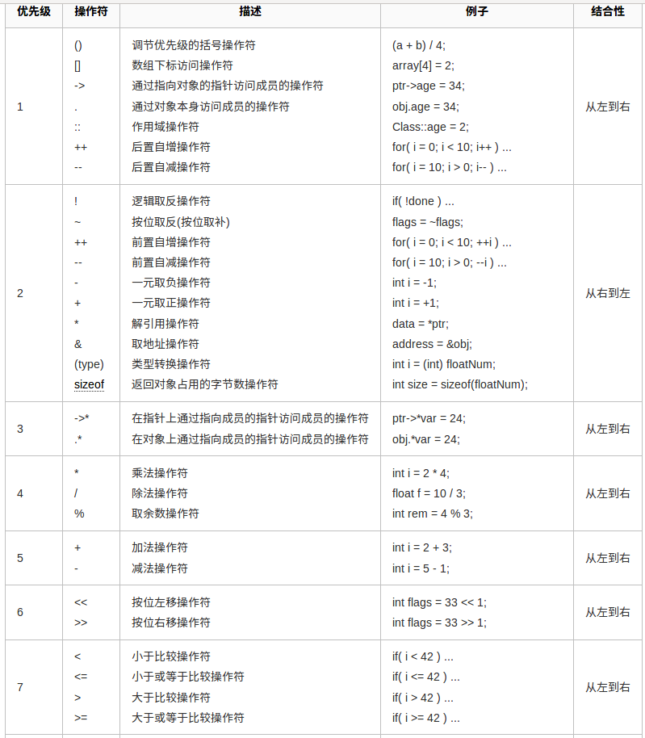
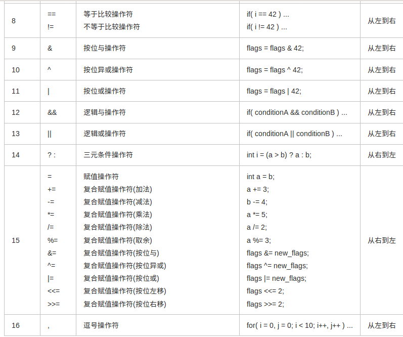

## c++总结&学习
> c++开始学习到现在已经很长时间了， 也接触到了很多c11的特性，智能指针， lambda， decltype...，且发现某些知识不是很牢固， 虚函数机制， 运算符顺序，stl， 故整理c++,  学过的知识每天1章， 并加入新的c++知识....

---

###  4. 表达式

#### 基本概念
1. **运算符**， 一元运算符(!, ~)和二元运算符(+, -)， 元的意思就是这个运算符可以操作的操作数的个数，具体含义还要看上下文， 比如 * 一元时代表解引用， 二元代表乘法， 还有一个三元运算符， 也叫三目运算符,  exp  ?  exp   : exp
2. 理解表达式首先要理解运算符的优先级， 结合率， 以及运算对象的求值顺序，  5 + 10 * 20 / 2 ;就有很多的求值顺序
3.  **类型转换**， 如果两个被操作的操作数类型不一致， 就会发生隐式转换， 有时提升， 有时下降
4.  **重载运算符**， << 和 >> 运算符以及, string对象使用的=， < , > 都是重载的运算符， 他可以定义运算对象的类型和返回类型，**但是运算对象的个数(也就是所属元)和优先级和结合率是不变的**
5. **左值和右值**，  c++的表达式要么是左值， 要么是右值,  当一个对象被当作右值的时候， 用的是对象的值， 左值的时候， 用的是对象的身份(在内存的位置)。 需要右值的地方可以用左值替代(用的也是他的值)， 但是不能把右值当作左值
 - 赋值运算符需要一个左值作为左侧对象， 得到结果也是左值， 连等成立就是因为这个
 - 取地址作用与一个左值对象， 返回一个指向对象的**临时指针**， 指针是一个右值。原来是这样.....
 - 解引用， 下标运算符，包括迭代器的解引用  string 下标运算符， 返回的都是左值
 - 内置和迭代器的递增递减运算符 作用于左值对象， 前置版本返回的也是左值
 - decltype 如果表达式的求值结果是左值， 返回的是引用类型， 假定p类型是int * ， decltype返回的结果是int & ,   取地址符返回的是右值， 所以decltype(&p) 的结果int **, 也就是一个指向整形指针的指针.

#### 运算符优先级和求职顺序
1. 左结合率， 意味着如果算术优先级相同，则从左到右开始运算
2. 括号可以无视优先级，和结合率
3. 优先级确定了组合方式， 但是没有说明对象按照什么顺序求值， 例如`int i = f1() * f2();`f1和f2一定在乘法之前被调用， 但是无法确定谁先执行，如果指向同一对象并修改，将会产生未定义的行为， 例如 << 运算符没有指定， 因此
```
int i = 0;
cout << i << " " << ++i << endl;     不同编译器输出0, 1 或者1， 1， 结果不可预知， 无论输出什么都是错的
```
4. 有4种运算符明确规定了求值顺序， &&   ||     **? :** 三目   **,**逗号表达式，  求职顺序和优先级以及结合率无关。
5. m % n 在结果不为0 时， 则他的符号和m相同
6. && 和 || 短路求职   
7. 关系运算符都满足左结合率, 赋值运算符和条件运算符满足右结合率 
8. 尽量不要使用后置版本++        
9. ptr->mem  等价于 (*ptr).mem, 解引用运算符优先级低于点运算符， 所以加括号，  箭头运算符作用于一个运算对象， 结果是左值。 点运算符，如果成员所属的对象是左值，那么结果就是左值， 右值就是右值
10. 条件运算符优先级很低, 最好要加括号
```
cout << grade < 60 ? "fail" : "pass";         <<  的返回值是cout所以
等价
cout << grade;
cout < 60 ? "fail" : "pass";
```
11. 位运算只能作用于整数类型或字符类型。
12. sizeof  运算符运算对象中解引用一个无效指针仍然是一种安全的行为， 因为指针没有被使用， 不需要真的解引用指针也能知道对象的类型。  对数组执行sizeof， 相当于对数组中的每个元素各执行一次sizeof的求和，涨姿势了。。。
13. 逗号表达式返回的是逗号右面的值。




#### 显示转换和隐士转换
1. 隐士转换
> 当运算对象类型不一致时， 就会发生隐士转换， 一般都是小转大， 都小于int 都转成int 比较，
> 还有一种特殊情况， 一个是无符号类型， 一个是有符号类型， 如果有符号类型小于无符号类型(不是值)， 有符号转成无符号，   如果有符号类型大于无符号类型， 此时转换依赖机器。。如果无符号的所有值都能存在该带符号类型中， 则无符号转化成带符号， 否则带符号转化成无符号,   **说了那么多， 我没怎么看懂**

2. 显示转换    static_cast   const_cast  dynamic_cast  reinterpret_cast
> static_cast   只要不包含底层const， 都可以用，通常用来普通类型转换， 好处是， 高精度转低精度不报警告  
>  const_cast 只能改变运算对象的底层const， 常常去掉const属性
>  dynamic_cast 通常用来类之间的转换， 通常是子类转换成父类
>  reinterpret_cast 常用来指针之间的转换，它可以把一个指针转换成一个整数，也可以把一个整数转换成一个指针（先把一个指针转换成一个整数，再把该整数转换成原类型的指针，还可以得到原先的指针值）。但是很危险。不建议使用

### 5. 语句作用域
1. 加上**;** 就变成了表达式语句， `;`代表空语句， 所以`while(exp) ;  ` 一直执行exp直到不成立
2. 块不以分号结束， 可以用空块作为结束
3. case 标签必须是整形常量表达式， 变量和浮点都不行
4. 任何两个case标签不能一致
5. 即使不准备在default标签下做任何事， 也尽量定义， 目的是告诉读者， 考虑到了默认的情况，只是暂时不做处理
6. 在switch内部的变量定义，  如果在某处一个**带有初值的变量**位于作用域外， 在另一处该变量位于作用域内部， 则从前一处跳转到后一处的行为是非法的。
```
case true : 
       string file_name;    //错误， 试图跳过一个隐士初始化对象
       int val = 0;         // 错误，。 试图跳过一个显示对象
       int xval;            //正确
       break;
case false : 
      xval = next(); 
      if(file_name.empty())...
```
7. c11 新引入更简单的for， 这种可以遍历容器或者其他序列的所有元素， 
`for (declaration : expression)   statement`    expression 必须是一个序列， 比如花括号括起来的初始化列表， 数组， 或者vector 或 string 等类型的对象，   这些类型的的特点是都能返回迭代器的begin和end成员, 此项编译必须加上`-std=c++11`， 不然嘿嘿。。。
8. 当catch语句一旦完成， 程序跳转到try语句最后一个catch子句之后的那条语句继续执行， try语句块内声明的变量在块外部无法访问， 特别是catch也无法访问.
9.  异常类型只定义一个名为what的成员函数， 该函数没有任何参数， 返回的指向c风格的字符串(是初始化的具体对象时所用的string副本)， `const char *`， 
10.  当异常被抛出时， 首先搜索抛出该异常的函数， 如果没有找到匹配的catch子句， 终止该函数，在调用该函数的函数中继续寻找，以此类推， 沿着程序的执行路径逐层回退， 直到找到适当类型的catch子句位置， 最终还是没找到匹配的catch子句， 程序转到terminate的标准库函数， 一版情况下， 执行该函数将导致程序异常退出
11.  没有try的语句也会向前面介绍一样， 找到最后没有匹配的catch语句， 异常退出
12.  对于其他无初始值的异常类型说， what返回的内容由编译器决定
13.  我们只能以默认初始化的方式初始化exception， bad_alloc和bad_cast对象， 不允许为这些对象提供初始值，其他异常类型的行为恰好相反， 应该使用string或者c风格字符串初始化这些对象， 不允许使用默认的初始化方式。  还没接触过太多异常， 接触到回来看。  来自 prime 176 

